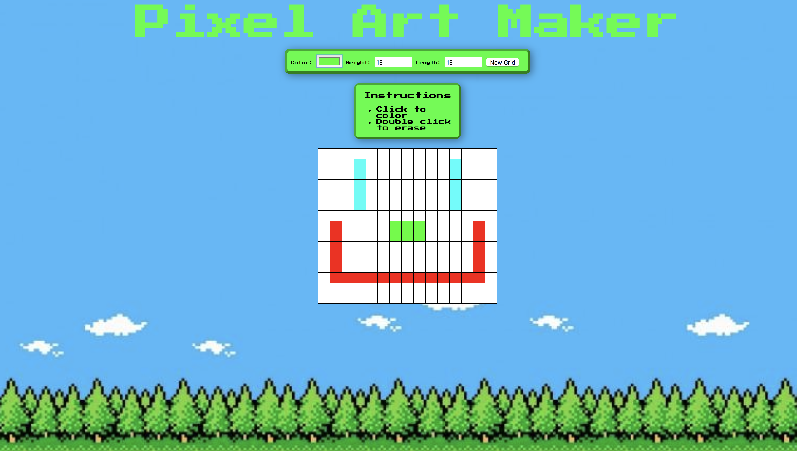

# Pixel-Art-Maker #
Website for creating pixel art using JQuery.
Final project of the Grow with Google Challenge Udacity scholarship.
Simply pick the size of your canvas, pick your colors, and begin making pixel art!

## Instructions ##
To use this art maker, visit https://miriarte33.github.io/Pixel-Art-Maker/ 

## Resources ##
Uses jQuery for easy acces and manipulation of DOM elements.

## Screenshots ##

